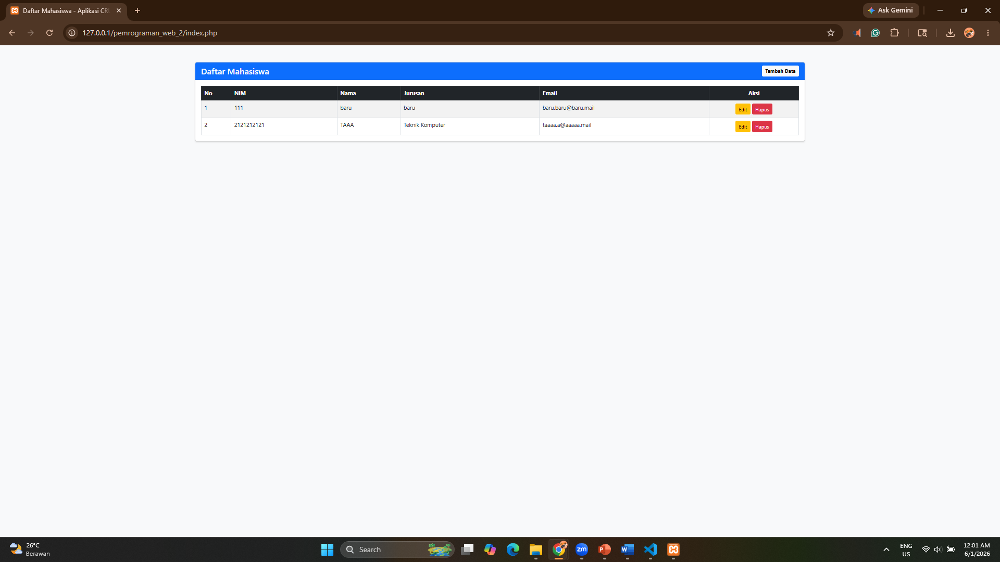
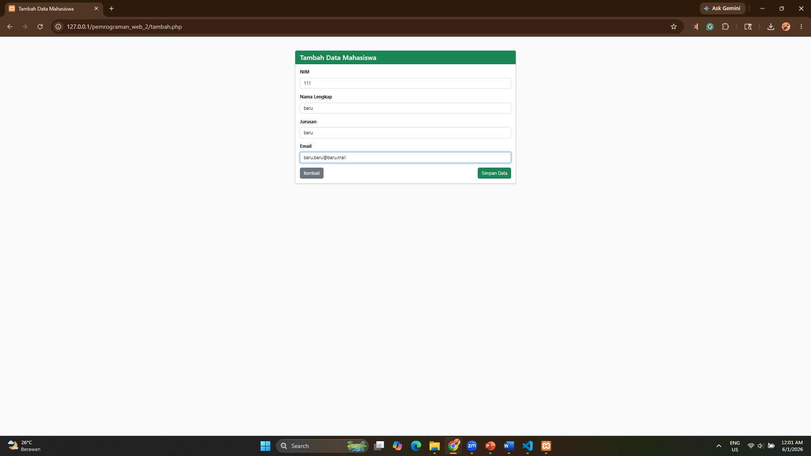
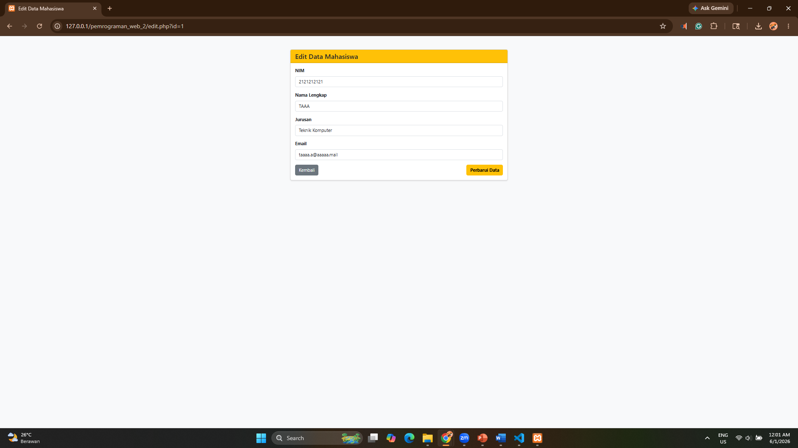

# Tugas Proyek - Pemrograman Web II
Aplikasi Mini CRUD Menggunakan PHP dan MySQLi Extension dengan pendekatan Object-Oriented Style.

## Identitas
- **Nama:** Taqiyuddin Ja'far
- **NIM:** 250401020186

## Fitur Utama
1. Menampilkan data dari database (Read)
2. Menambahkan data baru dengan Prepared Statement (Create)
3. Mengubah data (Update)
4. Menghapus data (Delete)
5. Penanganan error jika koneksi atau query gagal.

## Screenshots Hasil Program

### 1. Halaman Utama (Tampil Data)

### 2. Form Tambah Data

### 3. Form Edit Data
